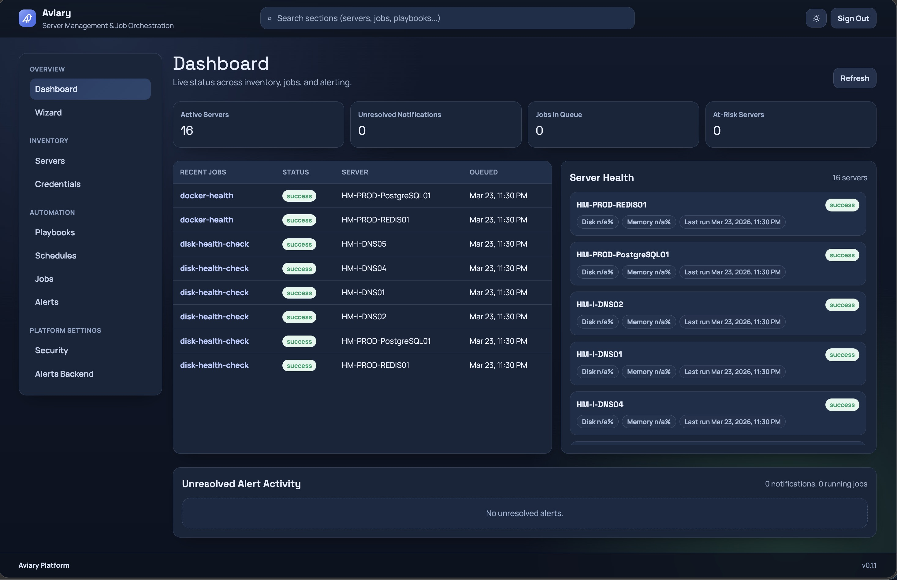

# Aviary
 
*Agent-less Linux server management. No daemons. No plugins. Just SSH.*
 
- **Website:** [getaviary.app](https://getaviary.app)
- **GitHub:** [github.com/robertherbaugh/aviary](https://github.com/robertherbaugh/aviary)

## What is Aviary?
 
Aviary is an open-source, agent-less Linux server management platform built for simplicity and power users. It handles scheduled patch management, health monitoring, storage visibility, playbook execution, and alerting — all over SSH with zero footprint on managed hosts. Designed for homelabs and business uers alike.
 
No agents. No plugins. No daemons. If your server speaks SSH, Aviary can manage it.


 
> *"Aviary is an agent-less Linux server management platform. Merlin handles the API, Swift workers execute over SSH, Cuckoo drives the scheduler, and Kestrel watches for alerts. Manage it all from Perch, or drop into the Wren CLI."*
 
## The Aviary Ecosystem
 
Every component in Aviary is named after a bird. Each name is intentional.
 
| Component | Bird | Why it fits |
|---|---|---|
| Platform / brand | **Aviary** | The home where all the birds live |
| Frontend UI | **Perch** | Where you sit and observe everything |
| API server | **Merlin** | Small but powerful falcon — the brain of the operation |
| Python SSH workers | **Swift** | The fastest bird alive — swoops in and out without leaving a trace |
| Job scheduler | **Cuckoo** | Universally known for precise timing |
| Alert engine | **Kestrel** | Hovers perfectly still, watching for problems from above |
| Playbook runner | **Finch** | Reliable, methodical — does the actual work |
| CLI tool | **Wren** | Tiny, fast, gets into everything — `wren run`, `wren deploy` |
| Credential / secret store | **Magpie** | Famous for collecting and hoarding shiny things |
| Audit / event log | **Raven** | Watches everything, remembers everything |
 
## Architecture
 
Aviary is built as a distributed microservices platform from day one. Each service is independently deployable and horizontally scalable. PostgreSQL is the single source of truth for all state, job queuing, and results — no Redis, no RabbitMQ, no additional queue infrastructure required.
 
```
┌─────────────────────────────────────────────────────┐
│                     Perch                           │
│              Next.js / React Frontend               │
│         (wizard-driven UI, SSO login, dashboards)   │
└──────────────────────┬──────────────────────────────┘
                       │ HTTPS / REST / WebSocket
┌──────────────────────▼──────────────────────────────┐
│                     Merlin                          │
│                 Fastify 5 API Server                 │
│  - Auth / OIDC (Arctic + Authentik)                 │
│  - Inventory & credential management (Magpie)       │
│  - Playbook management (Finch)                      │
│  - Job scheduling via pgBoss (Cuckoo)               │
│  - Alert evaluation (Kestrel)                       │
│  - Audit/event log (Raven)                          │
│  - Prisma ORM / migrations                          │
└──────────┬───────────────────────┬──────────────────┘
           │ pgBoss (Postgres)     │ gRPC (job streams)
┌──────────▼──────────┐   ┌───────▼──────────────────┐
│       Cuckoo        │   │          Swift           │
│   Job Scheduler     │   │    Python SSH Worker(s)  │
│   (pgBoss queue)    │   │  - AsyncSSH execution    │
└──────────┬──────────┘   │  - Playbook interpreter  │
           │              │  - Result reporting      │
           └──────────────│  - Stateless / scalable  │
                          └───────────┬──────────────┘
                                      │ SSH (port 22)
                          ┌───────────▼───────────────┐
                          │     Target Linux Servers  │
                          │   (no agents or plugins)  │
                          └───────────────────────────┘
```
## Services
 
### Perch — Frontend UI
 
The user-facing interface. Wizard-driven for onboarding servers, creating playbooks, and configuring schedules. Built on Next.js and React with a focus on clarity and operational simplicity.
 
**Key responsibilities:**
- Server onboarding wizard (hostname, IP, port, credential selection, tags)
- Playbook creation wizard (command sequences, scheduling, target selection)
- Dashboard — per-server health cards (disk, memory, uptime, last run status)
- Real-time job output streaming via gRPC
- Job history and run log viewer
- Alert configuration and notification preferences
- SSO login via Authentik OIDC redirect
 
**Tech:** Next.js, React, Tailwind CSS, ShadCN UI
 
### Merlin — API Server
 
The core application server. Owns all business logic, data access, and job orchestration. Stateless beyond its PostgreSQL connection and fully independently deployable.
 
**Key responsibilities:**
- OIDC authentication flow via Arctic (Authentik provider)
- JWT session management
- CRUD for servers, credentials, playbooks, schedules, and alerts
- Job creation and scheduling via pgBoss (Cuckoo)
- Receiving and storing results from Swift workers
- Alert evaluation on result ingestion (Kestrel)
- Serving job history and run logs to Perch
- Audit/event logging (Raven)
 
**Tech:** Fastify 5, TypeScript, Prisma ORM, pgBoss, Arctic, PostgreSQL
 
### Swift — Python SSH Worker
 
A stateless background executor. Pulls jobs from the pgBoss queue in PostgreSQL, connects to target servers over SSH, executes playbook steps, streams output back via gRPC, and writes results to the database. Multiple Swift replicas can run simultaneously — pgBoss handles distributed job claiming and ensures no job is executed twice.
 
**Key responsibilities:**
- Poll pgBoss job queue via PostgreSQL
- Establish SSH connections to target servers (key-based or password auth)
- Execute playbook command sequences via Finch
- Stream stdout/stderr back to Merlin in real time via gRPC
- Parse output for structured health values (disk %, memory, service state)
- Report structured results and job status back to the database
- Handle connection timeouts, retries, and failure reporting
 
**Tech:** Python, AsyncSSH, asyncio, gRPC, Procrastinate (or direct pgBoss table polling)
 
### Cuckoo — Job Scheduler
 
Not a standalone service — Cuckoo is the scheduling layer embedded within Merlin, powered by pgBoss. Cuckoo is responsible for evaluating cron schedules, enqueuing jobs for Swift workers, and managing job lifecycle state.
 
**Key responsibilities:**
- Evaluate cron schedules and determine which jobs are due
- Enqueue jobs into the pgBoss queue in PostgreSQL
- Track job state transitions (queued → running → success / failed / timeout)
- Retry failed jobs within configured policy
- Prevent duplicate job enqueuing for the same schedule
 
**Tech:** pgBoss, PostgreSQL, cron-parser (embedded in Merlin/Fastify)
 
### Kestrel — Alert Engine
 
The alerting subsystem embedded within Merlin. Kestrel evaluates incoming job results against configured alert thresholds and triggers notifications when conditions are met. Named for the kestrel's ability to hover motionless in the air, watching for the slightest movement below.
 
**Key responsibilities:**
- Evaluate parsed job result values against alert rules (e.g. disk > 85%)
- Support operators: greater than, less than, equal to
- Severity levels: info, warning, critical
- Record alert triggers in the Raven audit log
- Deliver notifications to configured channels (**ROADMAP ITEM**)
 
### Finch — Playbook Runner
 
The playbook execution layer inside Swift workers. Finch interprets playbook step definitions, executes them in sequence over SSH, handles error conditions, and returns structured results. Named for the finch — reliable, methodical, always does what it's supposed to do.
 
**Key responsibilities:**
- Interpret playbook step definitions (command, expected exit code, parse rules)
- Execute steps sequentially over the active SSH connection
- Apply parse rules to extract structured values from stdout
- Handle step-level failure policy (abort on failure vs continue)
- Return per-step results including stdout, stderr, exit code, and duration
 
### Magpie — Credential Store
 
The credential management subsystem. Magpie stores and retrieves SSH credentials (keys and passwords) securely, encrypted at rest. Named for the magpie — a bird famous for collecting and hoarding shiny, valuable things.
 
**Key responsibilities:**
- Store SSH private keys and passwords encrypted at rest
- Associate credentials with one or more servers
- Provide credentials to Swift workers at job execution time
- Support multiple credential types: SSH key, password
- Credential rotation support (**ROADMAP ITEM**)
 
### Raven — Audit & Event Log
**ROADMAP ITEM**
 
The audit and event logging subsystem. Raven records every significant action in the platform — who ran what, against which server, and what the outcome was. Named for the raven — a bird that watches everything and forgets nothing.
 
**Key responsibilities:**
- Record all job executions with user context
- Log authentication events (login, logout, failed attempts)
- Track credential access events
- Store alert trigger history
- Provide a queryable event timeline per server and per user
 
### Wren — CLI Tool 
**ROADMAP ITEM**
 
The command-line interface for Aviary. Wren lets operators interact with the platform directly from the terminal — running playbooks, checking server status, managing inventory, and deploying the stack. Named for the wren — tiny, fast, and gets into everything.
 
**Usage examples:**
```bash
wren server list
wren server add --host 192.168.1.10 --name prod-web-01
wren playbook run apt-upgrade --target prod-web-01
wren job status <job-id>
wren deploy stack
```


### Development Details

Monorepo for an agent-less SSH orchestration platform:
- `apps/web`: Next.js frontend
- `apps/api`: TypeScript API server
- `apps/worker`: Python async worker
- `packages/db`: Prisma schema and client
- `packages/types`: shared DTOs and validation schemas
- `packages/playbooks`: built-in playbook manifests

#### Versioning

Version is stored in the repository root `VERSION` file.

Use this flow before releasing or when versions drift:

- Update `VERSION` to the desired value.
- Run `bun run sync-version` to propagate it to all `package.json` files.
- Run `bun run check-version` to verify everything is in sync.

CI also runs this check (`version-sync-check`) so merge requests fail fast if versions mismatch.

For detailed instructions, see [`docs/versioning.md`](docs/versioning.md).

#### Quick start

1. Install deps: `bun install`
2. Copy env: `cp docker/.env.example .env`
3. Start infra: `docker compose -f docker/docker-compose.yml up -d postgres`
4. Run migrations (or let API startup apply deploy migrations): `bun run db:migrate:dev`
5. Seed data: `bun run db:seed`
6. Start services:
   - API: `bun --filter=@aviary/api run dev`
   - Web: `bun --filter=@aviary/web run dev`
   - Worker: `cd apps/worker && uv sync && uv run aviary-worker`
7. Open the web app:
   - First launch with no users: go to `/setup` to create bootstrap admin
   - Afterwards: sign in at `/sign-in` (password, TOTP MFA, or passwordless passkey)
   - Manage security and OIDC settings under `/automation/settings/security`
   - Configure alert delivery backend under `/automation/settings/alerts-backend`

`MIGRATE_ON_STARTUP=true` (default) makes the API run `prisma migrate deploy` before listening.

If you upgrade PostgreSQL major versions, reset the local Postgres volume first:
`docker compose -f docker/docker-compose.yml down -v`

#### Testing

- TypeScript: `bun run test`
- Python worker: `cd apps/worker && uv run pytest -q`
